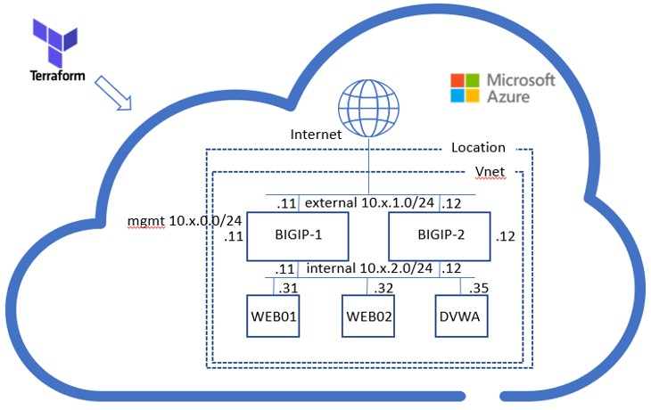

# F5 Automation Toolchain Workshop

## Getting Started

This workshop is intended to give more inside in the use of F5 Automation Toolchain and uses Terraform to deploy infrastructure, BIG-IPs and backends automatically in Azure public cloud.

F5 Automation Toolchain delivers that a BIG-IP can be turned into code and deployed in a declarative and automated way to provide L4- L7 application services. 

When you are not familiar with F5 automation Toolchain, please go to: https://clouddocs.f5.com/  and start reading.

Those who already have done the introduction to Automation & Orchestration aka supernetops training are invited to use this workshop to gain more understanding of the entire toolchain F5 has developed.

## Starting with UDF

When you are an F5 employee, select the “F5 EMEA Automation Toolchain Workshop” from the UDF Blueprint section and start deploying.
When you are invited by F5 into this workshop, you will get an invition by email and through UDF classroom will be able to launch the blueprint.
The student will find that a resource_group **‘student<number>-f5-atc-workshop’** and location **‘West Europe’** is already configured in Azure.
During the workshop which uses UDF, this is done for you. Once getting invited this resource group is there with the right location. Terraform will create its infrastructure here.

## Starting the lab without UDF

When you don't have access to UDF, please align to the mentioned per-requisites:
 * Having an Azure account.
 * Pre-configure a resource group.
 * Define a location within your pre-defined resource group.
 * Create a setup.yml from the setup_change.yml.

In the setup_changeme.yml the resource group and location are hardcoded and should be adjusted accordingly. Use the 'student_number' section to create the B-octet of your CIDR and subnets as described in module 1.

## How things work (both UDF and non-UDF)
Soon as you created the setup.yml you can start the environment by using Terraform commands. The "Getting Started" section and "Module 1" guide you through.
When Terraform starts deploying the infrastructure as shown in the network diagram, all dynamic allocated IP addresses and nesecarry values from Azure will get collected in "F5_ATC_EMEA_Partner_Workshop_postman_environment.json" which can be found in /postman after Terraform has finished the deployement. Some of those values are also published as output in Terraform.

[PREVIOUS](../README.md)      [NEXT](module_1/module1.md)