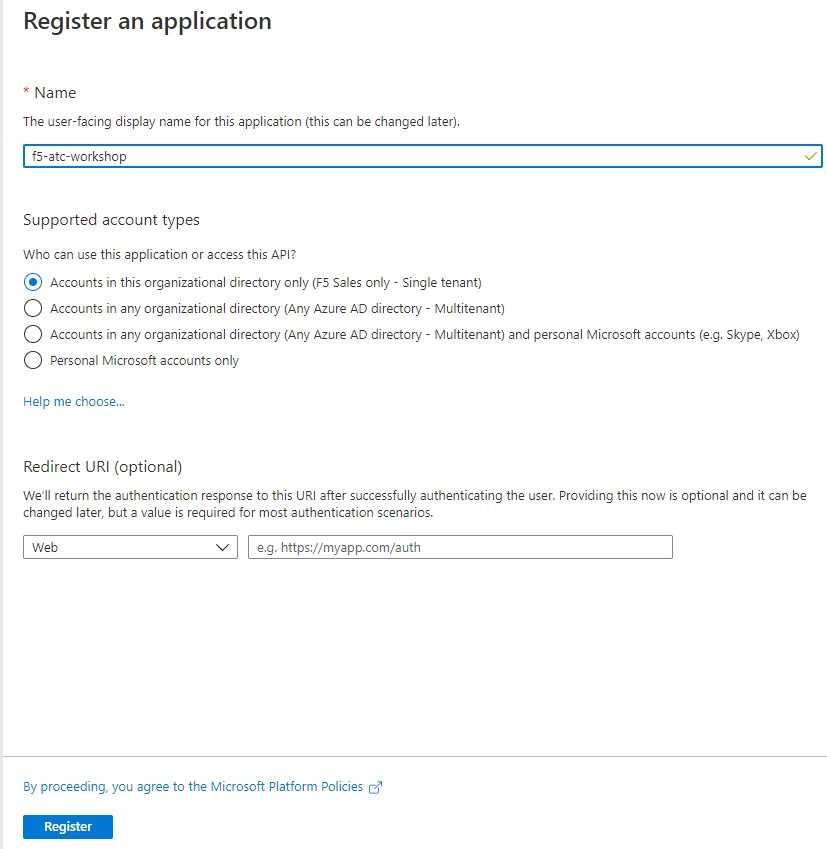
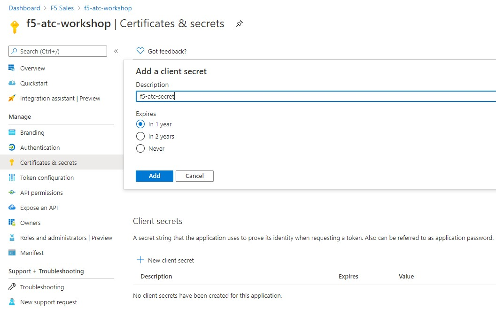
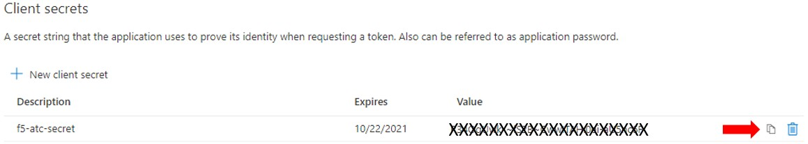
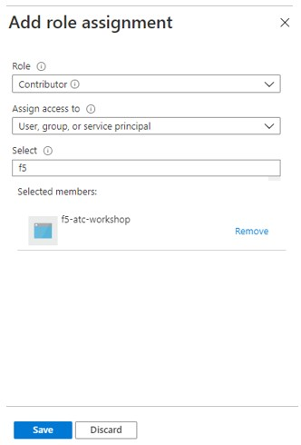
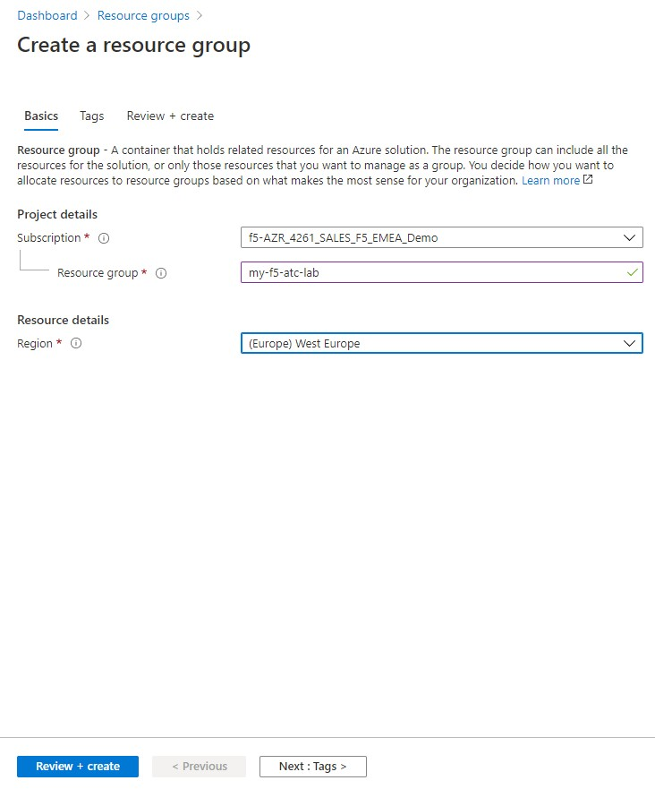
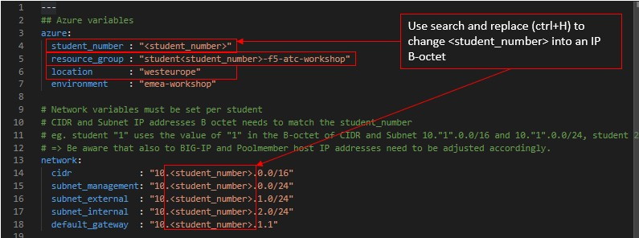

# Task 1.0 - Using the LAB without using an F5 UDF lab environment

This lab is developed with intention to be used also when not being able to use an F5 UDF pre-defined lab environment. Please read through the below instructions and act accordingly to get your environment up and running.

The following list of pre-requisites should be met:
 * Installing Terraform, Azure CLI, git, Postman and Visual Studio Code on your Jumphost.
 * Having an Azure account with an active subscription
 * create an Azure AD app registration and role assignment.
 * Subscribe to BIG-IP.
 * Creating a local Azure credentials file. 
 * Pre-configure a resource group.
 * Define a location within your pre-defined resource group.
 * Create a setup.yml from the setup_change.yml.

## 1. Installing software on the jumphost

To run this lab from your own jumphost you need to have Terraform, Azure CLI and Postman installed. The use of Virtual Studio Code is not mandatory, but will give you the ease of use throughout the lab when going through the exercises.

This section will not deliver a step-by-step approach how to install the mentioned packages, since the used jumphost can vary being Windows, MacOS or Linux. Instead here are links to the respected vendors for offical guidance how to install the mentioned software:
 * Terraform: https://learn.hashicorp.com/tutorials/terraform/install-cli
 * Azure CLI: https://docs.microsoft.com/en-us/cli/azure/install-azure-cli
 * Git: https://git-scm.com/downloads
 * Postman: https://www.postman.com/downloads/
 * Visual Studio Code: https://visualstudio.microsoft.com/downloads/

Terraform, Azure CLI and Git must be included in your environemt.

## 2. Azure Account

**Disclaimer: Costs made by using this lab can not be claimed at F5 or the author.**

It is expected that you have an Azure account. When you don't have an Azure Account you can go: https://azure.microsoft.com/en-us/ to sign up. In most cases you will be able to get a 30 day free trial when you are new.


### 2.1 Configure Azure AD app registration
Some of the labs will require that the F5 BIG-IP interacts with the Azure API. To enable this communication, we need to configure Azure AD app registration and next we need to assign a role to this app registration so it can be used for its authentication purposes within the Azure API communication.
Below instructions are a subsctraction from the app registration quickstart: https://docs.microsoft.com/en-us/azure/active-directory/develop/quickstart-register-app

**Step 1:** In the Azure portal left pane, select **Azure Active Diectory > App registratrions** and click **+New Registration**. Give the registratrion a **Name** and leave the rest at its default and click **Register**.



**Step 2:** Stay in the registrated app and copy and paste the **Application (client) ID** and the **Directory (tenant) ID** to a temporary file. (eg. notepad or simular text file)

**Step 3:** In the registrated app, select **Certificates & secrets** and click **+ New client secret** to create a client secret and give it a description.



**Step 4:** Select a desired expiration period and click **Add**.

**Step 5:** In the **Client Secret** section copy the f5-atc-secret value and store it in your temporary file for later use.



**Step 6:** Go **Subscriptions** and select your registration and copy and paste your **Subscription ID** and add this value to your temporary file. (When **Subscriptions** is not in the left pane, type it in the search bar at the top of the Azure portal.)

**Step 7:** Within **Subscriptions**, select **Access control (IAM)** and press **+ Add** and select **add a role assignment**.

**Step 8:** in the **Add role assignment** section, select role **Contributer** and at **Select** type the name of your app registration. 




**Step 9:** Be sure to select your app registration and click **Save**.

## 3. Subscribe to BIG-IP
All F5 products are listed in the Azure marketplace and befoe you can deploy them automatically, you need to have your subscription set to enabed. You will only do this once and the configured setting will be reused each time you deploy.

**Step 1.** In the Azure portal search bar, type **"F5 BIG-IP Virtual Edition - BEST (PAYG)"** and in the new pane in the Marketplace section select the product.

**Step 2:** Select plan **F5 BIG-IP Virtual Edition - BEST (PAYG, 25Mbps)** from the drop-down menu and click **Get Started** right below this drop-down menu.

**Step 3:** If not already so, change the subscription status to **Enabled** and click **Save**.

## 4. Create Azure Creds file
For Terraform to be able to use Azure to deploy infrastrcuture it needs to have Azure access credentials configured.

**Step 1:** In your home directory create a directory /files.

**Step 2:** Within /files create a file called creds.yml with the following content:

```
subscription_id: "your Subscription ID"
client_id      : "your Application (client) ID"
client_secret  : "your Client Secret"
tenant_id      : "your Directory (tenant) ID"
```

Be sure that your file structure looks like this:

```
\<your home directory>\files\tmp.yml
```

In the next task you will git clone the repo into your home directory. Don't follow another structure, unless you know what you are doing.

## 5. Pre-configure an Azure Resource Group

**Step 1:** Go into the Azure Portal and in the left pane, select **Resource groups** and click **+ Add**.

The chosen resource group name and region can be freely chosen as long as you adjust the setup.yml accordingly.



## 6. Create and modify setup.yml
The setup.yml file is derived from the setup_changeme.yml. Before being able to do this you need to clone the f5-atc-workshop repo from Github.

**Step 1:** Locate the Github repo at: https://github.com/gwolfis/f5-atc-workshop and decide if you want to download it straight from the GUI or if you will use the VSC terminal.

In that case, from your home directory: **git clone https://github.com/gwolfis/f5-atc-workshop.git**

**Step 2:** Switch directories, ideally through the VSC terminal:  **cd f5-atc-workshop** and locate **setup_changeme.yml**.

**Step 3:** Create setup.yml by coping the setup_changem.yml. **cp setup_changeme.yml setup.yml**

**Step 4:** Use your favorite editor to open setup.yml and change:
 * the resource group name,
 * The location,
 * The B-octet CIDR and subnets by using search and replace (ctrl+H)



This finalizes the pre-work which needs to be done for non-UDF lab users.

You can continue the lab at task1_1 step 13 which can reach by hitting the **NEXT** button.

[PREVIOUS](module1.md)      [NEXT](task1_1.md)