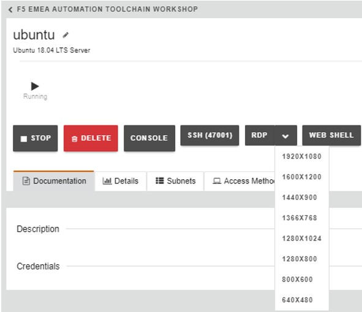
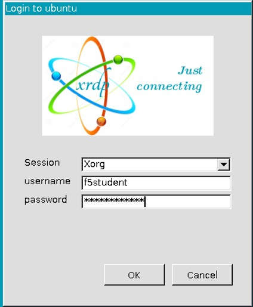
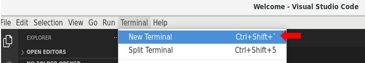
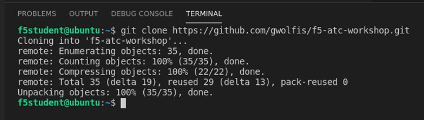
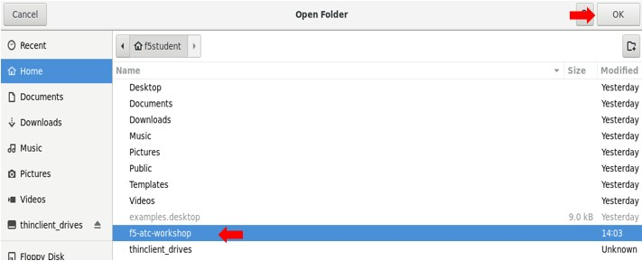
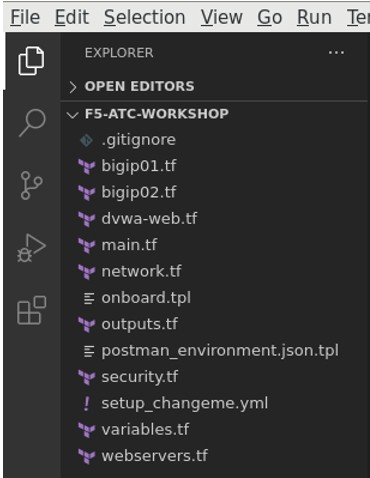
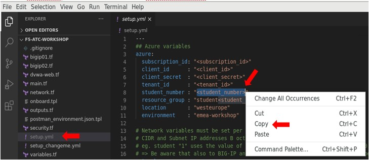
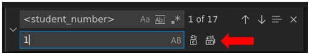
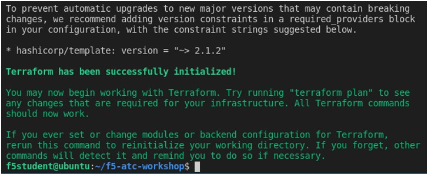
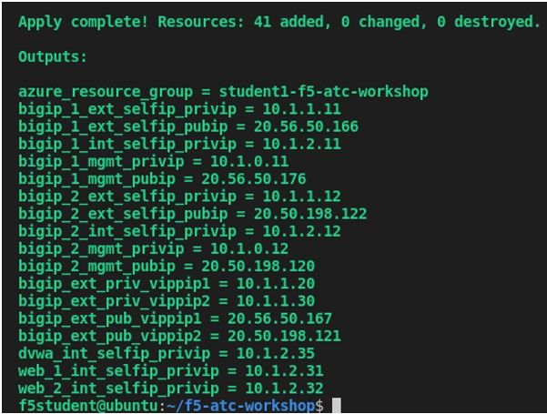

**********************************************
Task 1.1 Explore and start the lab environment
**********************************************
1.	From UDF, start an RDP session to the Jumphost. For modern laptops it might be a suggestion to use the 1440x900 resolution to keep things readable in the remote session.

    
2.	In the Remote Desktop Connection popup select ‘Connect’. Ignore the warning that the identity could not be verified and click ‘Yes’.
3.	Login to Ubuntu with ``f5student/f5student123``.

4.	Ignore any authentication pop-up by pressing **Cancel**.

5.	At the desktop, select ‘Activities’ in the upper left corner and select 

from the menu on the left. This will start Visual Studio Code.

6.	When no Terminal is shown, go to ‘Terminal’ and select ‘new Terminal’.
 

This will open a Terminal window in the lower section of VSC.

7.	In this terminal, which is bash based type: 

**git clone https://github.com/gwolfis/f5-atc-workshop.git**

This grabs the files we will going to use for the lab from Github and places them on the Jumphost.

8.	Let’s open the folder in VSC, by selecting 

in the left pane and in the Home directory select **‘f5-atc-workshop’** and click **‘OK’**.

The folder contains all the files to fire up the infrastructure in Azure public cloud by using terraform.

This lab does not contain a deep dive into Terraform since this is out of scope for the purpose of this workshop. The reason for showing these files and deliver guidance to leverage Terraform for deploying the lab infrastructure comes with the idea that now one can deploy this lab everywhere, even in its own Azure environment.
If you don’t have Terraform skills, no worries, this guide with lead you through.

9.	In the terminal, be sure you are in the directory ``‘f5-atc-workshop’`` and type the following and press enter:

**cp setup_changeme.yml setup.yml**

10.	Select **‘setup.yml’** and in the file select **<student_number>** and right-click an select **‘Copy’**.

11.	Type **‘Ctrl+H’** to search and replace the label into your actual student number. This has been assigned to you when being in the workshop. The picture shows ‘1’, but this most be your assigned student number! And click to replace it either at once or piece by piece to understand what you are replacing.
 

12.	As a result, you should see that everywhere the label **<student_number>** is replaced by **‘<your_assigned_student_number’**. This counts for the student_number, and all B-octets of defined IP ranges and IP host addresses.
13.	Close the search and replace window and save the changes by pressing **‘Ctrl+S’**. Not saving the changes will make terraform fail!
14.	In the terminal we first need to navigate to the right directory: **cd f5-atc-workshop**
15.	In the terminal type: **terraform init**
 

You should see this output.

16.	Next, type: **terraform plan**

17.	Finally type: **terraform apply -auto-approve**

Terraform will take about ~5min to deploy the infrastructure. Time for coffee!

When all is deployed, you should see this output.

18.	Use your Azure credentials to open the Azure portal and select your resource group referenced by your student number. You should see all the deployed infrastructure objects.
