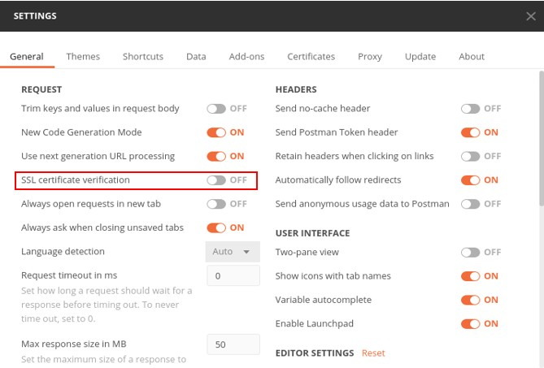
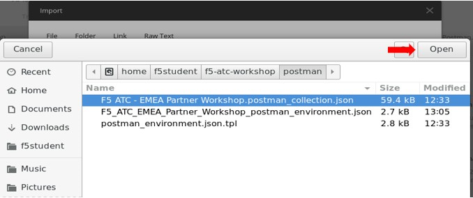
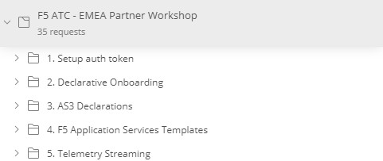
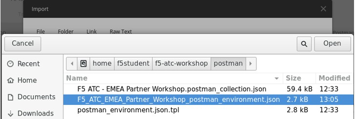

# Task 1.2 - Setup Postman

This task will make Postman ready for being used with this lab.

**Step 1:** On the Jumphost, go to the ``Activities`` pane on the left and select **Postman**

**Step 2:** Once Postman has started up, you can ignore the login screen and go to the bottom of the page and select “Skip signing in and take me straight to the app”.

**Step 3:** Welcome to Postman! Select **file** and click **Settings** and turn off **“SSL certificate verification”**.

Next, we are going to import the Postman collection and environment files.

**Step 4:** In Postman, select **‘Import’** from file and in the Home directory select: **f5-atc-workshop > postman** and select **“F5 – EMEA Partner Workshop.postman_collection.json”**. Click **‘Open’**.

Next, hit **‘Import’**.

In Postman select **‘Collections’** and open **“F5 ATC -EMEA Partner Workshop”**.
 

 
**Step 5:** Now we need to set the Postman environment for this lab. So, once more click **‘Import’** from file and in the same postman directory and now select **“F5_ATC_EMEA_Partner_Workshop_postman_environment.json”** and hit **‘Open’** and **‘Import’**.

**Step 6:** In Postman, go to the environment section in the top right and use the drop-down menu to switch from “No Environment” to “F5 ATC – EMEA Partner Workshop”. Be aware that during the deployment of the infrastructure, this file has been auto-generated by Terraform.

**Step 7:** Use the ‘eye’ icon   to watch the configured variables.

**Step 8:** Postman is almost ready there is one one final step to make and this is to import F5 workflow functions from Github. In Postman, open **Import** but this time **from link**. Copy and paste the following link: https://raw.githubusercontent.com/0xHiteshPatel/f5-postman-workflows/master/F5_Postman_Workflows.postman_collection.json and click **Continue** and **Import**.

**Step 9:** Navigate to **Postman > Collections** and select the section **F5_Postman_Workflows** and click **Instal**.

**Step 10:** Select **Install/Upgrade f5-postman-workflows** and hit **Send** next to the URL.

**Step 11:** Verify the the install was succesfull by checking the Postman environment and the global section should have _f5_workflow_functions deployed.

Postman is ready to be used within our lab.

[PREVIOUS](task1_1.md) [NEXT](task1_3.md)