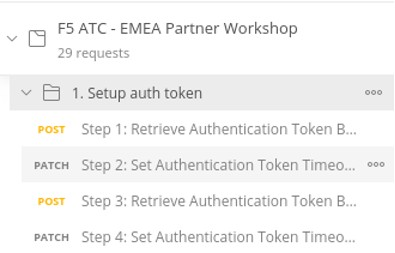

********************************
Task 1.3 - Authentication Tokens
********************************

Step 1: In Postman, open the collection and select **“1. Setup auth token”**.

 
Step 2: Select **“Step 1: Retrieve Authentication Token BIGIP1”** and check the Header and Body. As you can see in the Body, you don’t need to enter a username and password, these are part of the environment variables. Hit **‘Send’** to Post the declaration.
The authentication Token will get retrieved and via the Postman Test and put in the according variable in the environment.

Step 3: Select **“Step 2: Set Authentication Token Timeout BIGIP1”** to Patch the token timer and click **‘Send’**.

Step 4: Repeat the previous steps for BIG-IP2 by using the defined Postman request in step 3 and 4.
