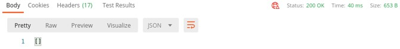

****************************
Task 2.1 – Deploy Onboarding
****************************
Step 1: Open Postman, select the F5 ATC collection and click “2. Declarative Onboarding”
First let’s check what is already on the BIG-IP from a DO perspective.
Step 2: The first step is always to verify if DO is installed on the BIG-IP. Select “Step 2.0: GET DO info” and click ‘Send’.
 
 .. image:: ../png/module2/task2_1_p1.png
    :align: center

The BIG-IP returns a 200 OK with the DO version currently installed.

Step 3: In Postman, in the left pane, select “Step 2.1: GET DO declarations”, check the declaration, and click ‘Send’.
When everything is correct you got and “[ ]” back which is correct since we have not declared an onboarding declaration yet.

Step 4: Next, let’s select “Step 2.2: Deploy Declarative Onboarding” and check the Body.

Check underneath Declarative Onboarding json schema and remark to following:

 - It does not declare a license, since we are using PAYG
 - Since we are using TMOS > v14, we need to define a password for the admin user, though the same is kept. Prior v14, this is not needed in a DO declaration.
 - This is a single BIG-IP, so no clustering is defined.
 - Variables are used to define the network items. Check them in the environment.

The JSON schema is printed underneath to have a better view.

.. code-block:: json
   
 {
    "schemaVersion": "1.2.0",
    "class": "Device",
    "async": true,
    "label": "Onboard BIG-IP",
    "Common": {
        "class": "Tenant",
        "mySystem": {
            "class": "System",
            "hostname": "bigip01.westeurope.azure.local"
        },
        "myDns": {
            "class": "DNS",
            "nameServers": [
                "8.8.8.8"
            ]
        },
        "myNtp": {
            "class": "NTP",
            "servers": [
                "0.pool.ntp.org",
                "1.pool.ntp.org",
                "2.pool.ntp.org"
            ],
            "timezone": "Europe/Amsterdam"
        },
        "{{bigip_username}}": {
            "class": "User",
            "userType": "regular",
            "password": "{{bigip_password}}",
            "shell": "bash"
        },
        "myProvisioning": {
            "class": "Provision",
            "ltm": "nominal",
			"asm": "nominal"
        },
        "external": {
            "class": "VLAN",
            "tag": "10",
            "mtu": "1500",
            "interfaces": [
                {
                    "name": "1.1",
                    "tagged": false
                }
            ]
        },
        "external-self": {
            "class": "SelfIp",
            "address": "{{bigip_1_ext_selfip_privip}}/24",
            "vlan": "external",
            "allowService": "default",
            "trafficGroup": "traffic-group-local-only"
        },
        "internal": {
            "class": "VLAN",
            "tag": "20",
            "mtu": "1500",
            "interfaces": [
                {
                    "name": "1.2",
                    "tagged": false
                }
            ]
        },
        "internal-self": {
            "class": "SelfIp",
            "address": "{{bigip_1_int_selfip_privip}}/24",
            "vlan": "internal",
            "allowService": "default",
            "trafficGroup": "traffic-group-local-only"
        },
        "default-gateway": {
            "class": "Route",
            "gw": "{{default_gateway}}",
            "network": "default",
            "mtu": 1500
        }        
    }
 }

Step 5: Be aware that rendering this json schema will take a minute. Let’s check how the declaration is processing by selecting “Step 2.3: GET DO task” and click ‘Send’.

It will show that the declaration shows status ‘running’ with code 202.
 

Keep refreshing by resending until you will show status ‘OK’ with code 200, this means that the declaration is processed, and the BIG-IP is ready.
 
As an alternative you can use the used declaration in step 2.1, which is syntaxial the same as the POST-ed declaration of step 2.2, of course with the exception that the used method is GET. Changing the POST into a GET will deliver the same declaration and response.
Step 6: Log into the BIG-IP and check the hostname and network settings as it is declared. 
When you forgot the public mgmt IP of BIG-IP, you can check the output in the terminal of Visual Code. When not visible type: terraform output to get them refreshed. Select the IP address and use ‘Crtl+C’ to copy the IP address for using it in your browser.

Or

Check the environment variables in Postman.

Step 7: For Onboarding BIGIP2, repeat steps 5 and 6, but use the respected Postman declarations defined in step 2.4 and 2.5.

The DO JSON schema for BIGIP-2 is included in the mentioned steps, but can be found and checked below for your reference.

.. code-block:: json
   
 {
    "schemaVersion": "1.2.0",
    "class": "Device",
    "async": true,
    "label": "Onboard BIG-IP",
    "Common": {
        "class": "Tenant",
        "mySystem": {
            "class": "System",
            "hostname": "bigip02.westeurope.azure.local"
        },
        "myDns": {
            "class": "DNS",
            "nameServers": [
                "8.8.8.8"
            ]
        },
        "myNtp": {
            "class": "NTP",
            "servers": [
                "0.pool.ntp.org",
                "1.pool.ntp.org",
                "2.pool.ntp.org"
            ],
            "timezone": "Europe/Amsterdam"
        },
        "{{bigip_username}}": {
            "class": "User",
            "userType": "regular",
            "password": "{{bigip_password}}",
            "shell": "bash"
        },
        "myProvisioning": {
            "class": "Provision",
            "ltm": "nominal",
			"asm": "nominal",
            "gtm": "nominal"
        },
        "external": {
            "class": "VLAN",
            "tag": "10",
            "mtu": "1500",
            "interfaces": [
                {
                    "name": "1.1",
                    "tagged": false
                }
            ]
        },
        "external-self": {
            "class": "SelfIp",
            "address": "{{bigip_2_ext_selfip_privip}}/24",
            "vlan": "external",
            "allowService": "default",
            "trafficGroup": "traffic-group-local-only"
        },
        "internal": {
            "class": "VLAN",
            "tag": "20",
            "mtu": "1500",
            "interfaces": [
                {
                    "name": "1.2",
                    "tagged": false
                }
            ]
        },
        "internal-self": {
            "class": "SelfIp",
            "address": "{{bigip_2_int_selfip_privip}}/24",
            "vlan": "internal",
            "allowService": "default",
            "trafficGroup": "traffic-group-local-only"
        },
        "default-gateway": {
            "class": "Route",
            "gw": "{{default_gateway}}",
            "network": "default",
            "mtu": 1500
        }        
    }
 }

Declarative Onboarding has finished.
