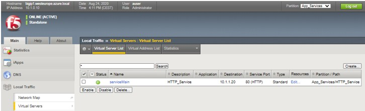

# Task 3.1 – HTTP Service with Service Discovery


In this exercise you will deploy an AS3 HTTP_Service declaration where service-discovery of poolmembers is taking place.

**Step 1:** Let’s check if AS3 has been installed on the BIG-IP by selecting **“Step 3.0: Deploy AS3 info”** and click **‘Send’**.


It will return a 200 OK with the installed version of AS3.

**Step 2:** Next, you want to know if the BIG-IP already has AS3 declarations installed by using **“Step 3.0.1: GET all AS3 declarations”** and click **‘Send’**. This time it will return a ‘204 No Content’.

**Step 3:**	Open the Postman collection ``“F5 ATC – EMEA Partner Workshop”`` and select **“3. AS3 Declarations”**.


**Step 4:** Select **“Step3.1: Deploy HTTP_Service”** and check the Body specifically at the poolmembers section. The declaration is included below for reference.

```json
{
    "class": "AS3",
    "action": "deploy",
    "declaration": {
        "class": "ADC",
        "schemaVersion": "3.7.0",
        "id": "Deploy_App_Services",
        "label": "Deploy_App_Services",
        "remark": "Deploy_App_Services",
        "App_Services": {
            "class": "Tenant",
            "HTTP_Service": {
                "class": "Application",
                "template": "http",
                "serviceMain": {
                    "class": "Service_HTTP",
                    "virtualAddresses": [
                        "{{bigip_ext_priv_vippip1}}"
                    ],
                    "snat": "auto",
                    "pool": "Pool1"
                },
                "Pool1": {
                    "class": "Pool",
                    "monitors": [
                        "http"
                    ],
                    "members": [
                      {
                            "servicePort": 80,
                            "addressDiscovery": "azure",
                            "updateInterval": 10,
                            "tagKey": "service_discovery",
                            "tagValue": "true",
                            "addressRealm": "private",
                            "resourceGroup": "{{resource_group}}",
                            "subscriptionId": "{{subscription_id}}",
                            "directoryId": "{{tenant_id}}",
                            "applicationId": "{{client_id}}",
                            "apiAccessKey": "{{client_secret}}",
                            "credentialUpdate": false
                        }
                    ]
                }
            }            
        }
    }
}
```


**Step 5:** Click **‘Send’** to POST “Step 3.1: Deploy HTTP_Service” you should receive a 200 OK


**Step 6:** Log into the BIG-IP and check the local traffic configuration. 

**Be SURE** to change the partition into the created App_Services partion to check the created VS.





You will notice that the Virtual Server is marked ‘Green’. Let’s grab the VS (VIP) public IP address from the Terraform output and test it. You will see either web01 or web02 respond.


Remember we did not include pool members into our initial configuration (JSON declared AS3 schema).

**Step 7:** Let’s check out what the Local > Pools > Pool1 and select the Members section:


This pool includes two poolmembers and those are discovered via service-discovery config declared via AS3.

Service-discovery works by defining tagging to either the virtual machine or the interface and for this setup it was already included during the Terraform deployment of the webservers. 

You can check this in Visual **Studio Code > bigip-3nic-setup > webservers.tf** and check the Web01 and Web02 tags. To see what the tag values are, checkout **setup.yml**.

**Step 8:** Now let’s verify these tags in Azure by open a browser and click the Azure portal link and select your personal resource group referenced by your student number.
Select virtual machine web01 and verify the name tag and value.


**Step 9:** In the same window, select tags and change the tag **‘service-discovery’** value from ‘true’ to ‘false’ and click **‘Save’**.


**Step 10:** Now, go back to your BIG-IP and check your poolmembers in Pool1. How many pool members do you see?
 

 
**Step 11:** Change back the tag value to **‘true’** in the Azure Portal and check the poolmembers section again.
Service-discovery of poolmembers can serve use cases, like:

 -	Taking a server backend from the pool for maintenance.
 -	Switch poolmember between ‘prod’ and ‘test’ environment.
 -	Automatically scale poolmembers when more get ramped up due to public cloud auto-scaling services.

[PREVIOUS](module3.md)      [NEXT](task3_2.md)