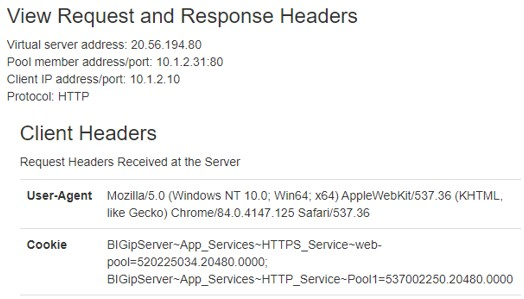
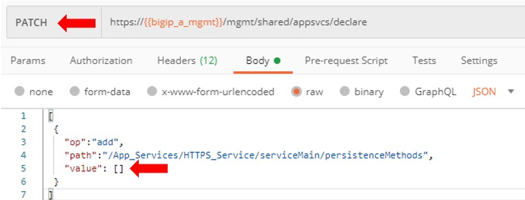

# Task 3.2 – Service HTTPS using HTTP to HTTPS redirect


This exercise will deploy application service using the Service HTTPS class and include adding a HTTP to HTTPS redirect.
If you left the previous HTTP Service deployed, then remember that a POST will update the current deployed application service with new deployed declaration.

**Step 1:** In Postman, open the collection **“F5 ATC – EMEA Partner Workshop”** and next select **“3. AS3 Declarations”**. Select **“Step 3.2: Deploy HTTP to HTTPS redirect Service”** and verify underneath JSON schema. 

```json

{
    "class": "AS3",
    "action": "deploy",
    "declaration": {
        "class": "ADC",
        "schemaVersion": "3.7.0",
        "id": "Deploying_App_Services",
        "label": "Deploying_App_Services",
        "remark": "Deploying_App_Services",
        "App_Services": {
            "class": "Tenant",
            "HTTPS_Service": {
                "class": "Application",
                "template": "https",
                "serviceMain": {
                    "class": "Service_HTTPS",
                    "virtualAddresses": [
                        "{{bigip_ext_priv_vippip1}}"
                    ],
                    "snat": "auto",                    
                    "pool": "web-pool",
                    "profileHTTP": "basic",
                    "serverTLS": "webtls"
                },
                "web-pool": {
                    "class": "Pool",
                    "monitors": [
                        "http"
                    ],
                    "members": [
                      {
                            "servicePort": 80,
                            "serverAddresses": [
                              "{{webserver_1}}",
                              "{{webserver_2}}"
                            ]
                        }
                    ]
                },
                "webtls": {
                    "class": "TLS_Server",
                    "certificates": [
                        {
                            "certificate": "webcert"
                        }
                    ]
                },
                "webcert": {
                    "class": "Certificate",
                    "certificate": {
                        "bigip": "/Common/default.crt"
                    },
                    "privateKey": {
                        "bigip": "/Common/default.key"
                    }
                }
            }            
        }
    }
}
```


**Step 2:** Click **‘Send’**.

**Step 3:** Verify the declaration in the BIG-IP. You should have the same sight as the figure below.


**Step 4:** Test the VS opening a web browser and go `http://<BIG-IP_external_public_vip_address>`

**Step 5:** Notice the redirect to HTTPS.

**Step 6:** Another thing you will notice is the fact that once a backend has been chosen, it will stick with that one. Go the web browser web01 or web02 depending which backend responded and click **Demos > View Request and Response Headers** and check the cookie section.




Cookie persistence is added as a default value to Service_HTTP and Service_HTTPS defined AS3 templates.

**Step 7:** In the collection, AS3 section, select **“Step 3.2.1: Disable persistence ServiceMain”** and click **‘Send’**.
The persistence method gets changed by using a PATCH.




PATCH can be used on several occasions where configuration should be modified to change the POST-ed declaration. The PATCH method will use an operator, in this case “add”. It needs a path and a value. For no persistence, the value of ‘persistenceMethods: []’.

**Step 8:** Re-test the backends and notice that you now will get switched between both backends. Be aware that cached objects of both backends will be shown.

**Step 9:** Delete the declaration by selecting **“Step 3.2.3: Delete Service_HTTPS declaration”** in Postman. Before doing so, take a minute, to check the body and notice:

 -	Deleting a declaration happens by declaring a POST
 -	The declaration needs to include the “id” and “Tenant” name at a minimum. As you can see the rest stays empty.

**Step 10:** Press **‘Send’** and check the BIG-IP. What got removed?

[PREVIOUS](task3_1.md)      [NEXT](task3_3.md)