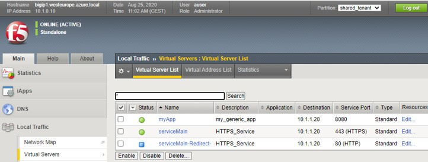

# Task 3.3 – ServiceMain and Generic


Service_HTTP and Service_HTTPS where the default templates until AS3 v3.20. These templates enforce to name each created virtual service to be named serviceMain. From v3.20 this has changed from serviceMain into service. Also, the generic template has become the default now which allows to use any name.

Task 3.3 covers:

 -	Show ServiceMain and Generic differences.
 -	Declare multiple applications in one AS3 deployment.
 -	Use of PATCH to modify applications within a tenant.

Step 1: In Postman, select **“Step 3.3: Deploy serviceMain and service Generic”**.

```json
{
    "class": "AS3",
    "persist": false,
    "declaration": {
        "class": "ADC",
        "schemaVersion": "3.20.0",
        "id": "serviceMain-and-generic",
        "shared_tenant": {
            "class": "Tenant",
            "my_generic_app": {
                "class": "Application",
                "myApp": {
                    "class": "Service_Generic",
                    "virtualAddresses": [
                        "{{bigip_ext_priv_vippip1}}"
                    ],
                    "virtualPort": 8080,
                    "shareAddresses": false,
                    "pool": "web-pool8080"
                },
                "web-pool8080": {
                    "class": "Pool",
                    "monitors": [
                        "http"
                    ],
                    "members": [{
                        "servicePort": 80,
                        "serverAddresses": [
                            "{{webserver_1}}"
                        ]
                    }]
                }
            },
            "HTTPS_Service": {
                "class": "Application",
                "template": "https",
                "serviceMain": {
                    "class": "Service_HTTPS",
                    "virtualAddresses": [
                        "{{bigip_ext_priv_vippip1}}"
                    ],
                    "shareAddresses": false,
                    "snat": "auto",
                    "pool": "web-pool",
                    "profileHTTP": "basic",
                    "serverTLS": "webtls"
                },
                "web-pool": {
                    "class": "Pool",
                    "monitors": [
                        "http"
                    ],
                    "members": [{
                        "servicePort": 80,
                        "serverAddresses": [
                            "{{webserver_2}}"
                        ]
                    }]
                },
                "webtls": {
                    "class": "TLS_Server",
                    "certificates": [{
                        "certificate": "webcert"
                    }]
                },
                "webcert": {
                    "class": "Certificate",
                    "certificate": {
                        "bigip": "/Common/default.crt"
                    },
                    "privateKey": {
                        "bigip": "/Common/default.key"
                    }
                }
            }
        }
    }
}
```

Step 2: Click **‘Send’** and after the 200 OK in the response, check the BIG-IP.



Within one tenant both Service_HTTPS and a Service_Generic are deployed.

Notice the following:

 - Service_Generic uses a random name, where Service_HTTPS is tied to the enforced naming.
 - All services are using the same VS IP address, but a different port
 - Tenants or partitions can include multiple applications.
 - Our webservers have been divided between the declared applications.
 - Web01 is used as a poolmember for my_generic_app.
 - Web02 is used as a poolmember for ServiceMain.

Step 3: Test the configuration by opening a web browser and test the different defined virtual servers:

 -	`http://<BIG-IP_external_public_vip_address>`
 -	`http://<BIG-IP_external_public_vip_address>:8080`

Step 4: What if we would want to reuse the same poolmembers and share it among the applications…
We are going to use a POST to add a function by copying the previous JSON schema into the body of **“Step 3.3: Deploy serviceMain and service Generic with shared poolmembers”**.
Next in the body find pool member section of my_generic_app and add the poolmember as shown in the picture.


  
Don’t forget to obey the JSON syntax set a comma after the first IP address, before adding “{{webserver_2}}”. 

Step 5: Click **‘Send’** and check the response by browsing to `http://<BIG-IP_external_public_vip_address>:8080`

Use ‘Ctrl+F5’ to refresh and switch between the poolmembers.
	Adding a poolmember could be done by using a PATCH as well.

Step 6: Now, let’s delete the deployment, but this time we only delete one application within the existing tenant. We can do this in two different ways, either by modifying the previous POST and delete the application section which we want to be removed from the tenant by re-POST-ing the declaration in its new existence or by using a PATCH.

Select **“Step 3.3.1: Remove application from tenant through AS3”** and select the body.
 
```json

 [
  {
    "op":"remove",
    "path":"shared_tenant/my_generic_app",
    "value": []
  }
 ]
```
The operator task is now to ‘remove’ and notice the path which is pointing to my_generic_app.
Now copy and paste and click **‘Send’**.

Step 7: Check the declaration via GET, this can be achieved by grabbing the declaration from Step 3.3 and change the declaration method from POST to GET and hit ‘Send’ and watch the response. 

Step 8: Check the BIG-IP. It should look similar as the below picture, where my_generic_app has been removed.


    :align: center

Step 9: Remove the entire config by selecting **“Step 3.3.3: Delete AS3 declaration serviceMain and generic”** and press **‘Send’**.

Step 10: Check the BIG-IP if the tenant has been removed.
