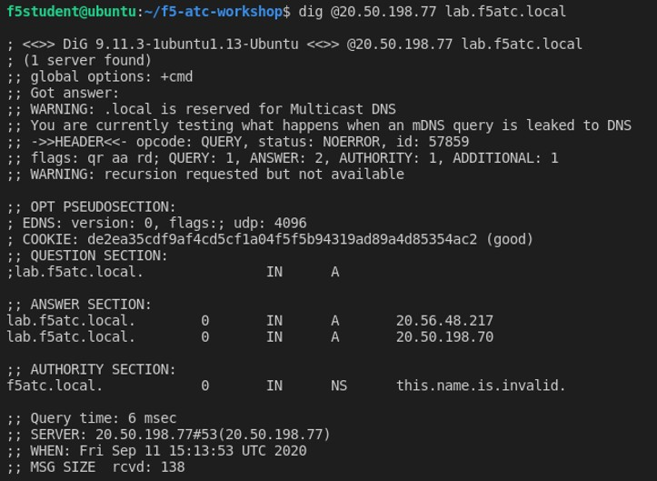

# Task 3.4 – Use of Global Server Load Balancing (GSLB)

This task will teach how to setup Global Server Load Balancing (GSLB) using AS3 declarations. 
To accomplish this, the following actions need to take place:

 - Setup BIGIP2 DO
 - Create an AS3 declared L4-L7 config at both BIG-IP’s
 - Create an AS3 config for GSLB
 - Test it

**Step 1:** In module 2 declarative onboarding for BIGIP2 should have taken place. When this is not the case, please go back and complete this task first before moving any further.

Once both BIG-IP’s are past the phase of onboarding, next they need to have some L4-L7 application services deployed to get towards demonstrating GSLB.

**Step 2:** In Postman, go to **“Step 3.4.1: BIGIP-1 AS3 deployment”** and select underneath body to copy and paste in the body of the AS3 declaration and hit **‘Send’**.

Before doing so, think what this AS3 declaration will do?

```json
{
    "class": "AS3",
    "action": "deploy",
    "declaration": {
        "class": "ADC",
        "schemaVersion": "3.7.0",
        "id": "Deploying_App_Services",
        "label": "Deploying_App_Services",
        "remark": "Deploying_App_Services",
        "App_Services": {
            "class": "Tenant",
            "HTTPS_Service": {
                "class": "Application",
                "template": "https",
                "serviceMain": {
                    "class": "Service_HTTPS",
                    "virtualAddresses": [
                        "{{bigip_ext_priv_vippip1}}"
                    ],
                    "snat": "auto",                    
                    "pool": "web-pool",
                    "profileHTTP": "basic",
                    "serverTLS": "webtls"
                },
                "web-pool": {
                    "class": "Pool",
                    "monitors": [
                        "http"
                    ],
                    "members": [
                      {
                            "servicePort": 80,
                            "serverAddresses": [
                              "{{webserver_1}}"
                            ]
                        }
                    ]
                },
                "webtls": {
                    "class": "TLS_Server",
                    "certificates": [
                        {
                            "certificate": "webcert"
                        }
                    ]
                },
                "webcert": {
                    "class": "Certificate",
                    "certificate": {
                        "bigip": "/Common/default.crt"
                    },
                    "privateKey": {
                        "bigip": "/Common/default.key"
                    }
                }
            }            
        }
    }
}
```

**Step 3:** Wait for the 200 response and check the declared AS3 deployment on BIG-IP01 and test if get answer from the backend when hitting the virtual server in a browser.

**Step 4:** Select **“Step 3.4.2: BIGIP-02 AS3 deployment”** and copy and paste underneath body and click **‘Send’**.

```json

{
    "class": "AS3",
    "action": "deploy",
    "declaration": {
        "class": "ADC",
        "schemaVersion": "3.7.0",
        "id": "Deploying_App_Services",
        "label": "Deploying_App_Services",
        "remark": "Deploying_App_Services",
        "App_Services": {
            "class": "Tenant",
            "HTTPS_Service": {
                "class": "Application",
                "template": "https",
                "serviceMain": {
                    "class": "Service_HTTPS",
                    "virtualAddresses": [
                        "{{bigip_ext_priv_vippip2}}"
                    ],
                    "snat": "auto",                    
                    "pool": "web-pool",
                    "profileHTTP": "basic",
                    "serverTLS": "webtls"
                },
                "web-pool": {
                    "class": "Pool",
                    "monitors": [
                        "http"
                    ],
                    "members": [
                      {
                            "servicePort": 80,
                            "serverAddresses": [
                              "{{webserver_2}}"
                            ]
                        }
                    ]
                },
                "webtls": {
                    "class": "TLS_Server",
                    "certificates": [
                        {
                            "certificate": "webcert"
                        }
                    ]
                },
                "webcert": {
                    "class": "Certificate",
                    "certificate": {
                        "bigip": "/Common/default.crt"
                    },
                    "privateKey": {
                        "bigip": "/Common/default.key"
                    }
                }
            }            
        }
    }
}
```

**Step 5:** Check the config on BIG-IP02 and test it just like step 3.

**Step 6:** Both BIG-IPs have the same ‘local’ configuration and if those should be able back each other up for disaster recovery reasons, drive migration scenarios or just deliver scale, that’s where the use of GSLB becomes handy. 

**Select “Step 3.4.3: Deploy GSLB”** and check the JSON body below to understand what get’s declared.


```json
{
    "class": "ADC",
    "schemaVersion": "3.6.0",
    "id": "GSLB_Sample",
    "GSLB_App_Services": {
        "class": "Tenant",
        "Application": {
            "class": "Application",
            "template": "generic",
            "testDomain": {
                "class": "GSLB_Domain",
                "domainName": "lab.f5atc.local",
                "resourceRecordType": "A",
                "poolLbMode": "ratio",
                "pools": [
                              { "use": "service-azure-eu-west1-pool" },
                              { "use": "service-azure-eu-west2-pool" }
                ]
            },
            "service-azure-eu-west1-pool": {
               "class": "GSLB_Pool",
                "enabled": true,
                "members": [
                    {
                        "ratio": 1,
                        "server": {
                            "use": "/Common/Shared/bigip1-azure-west-eu"
                        },
                        "virtualServer": "0"
                    }
                ],
                "resourceRecordType": "A"
            },
            "service-azure-eu-west2-pool": {
               "class": "GSLB_Pool",
                "enabled": true,
                "members": [
                    {
                        "ratio": 1,
                        "server": {
                            "use": "/Common/Shared/bigip2-azure-west-eu"
                        },
                        "virtualServer": "0"
                    }
                ],
                "resourceRecordType": "A"
            }
        }
    },
    "Common": {
        "class": "Tenant",
        "Shared": {
            "class": "Application",
            "template": "shared",
            "azure-west1-eu": {
                "class": "GSLB_Data_Center"
            },
            "azure-west2-eu": {
                "class": "GSLB_Data_Center"
            },
            "bigip1-azure-west-eu": {
                "class": "GSLB_Server",
                "dataCenter": {
                    "use": "azure-west1-eu"
                },
                "devices": [
                    {
                        "address": "{{bigip_1_ext_selfip_pubip}}",
                        "addressTranslation": "{{bigip_1_ext_selfip_privip}}"
                    }
                ],
                "virtualServers": [
                    {
                        "address": "{{bigip_ext_pub_vippip1}}",
                        "addressTranslation": "{{bigip_ext_priv_vippip1}}",
                        "addressTranslationPort": 443,
                        "port": 443,
                        "monitors": [{"bigip": "/Common/https"}]
                    }
                ]
            },
            "bigip2-azure-west-eu": {
                "class": "GSLB_Server",
                "dataCenter": {
                    "use": "azure-west2-eu"
                },
                "devices": [
                    {
                        "address": "{{bigip_2_ext_selfip_pubip}}",
                        "addressTranslation": "{{bigip_2_ext_selfip_privip}}"
                    }
                ],
                "virtualServers": [
                    {
                        "address": "{{bigip_ext_pub_vippip2}}",
                        "addressTranslation": "{{bigip_ext_priv_vippip2}}",
                        "addressTranslationPort": 443,
                        "port": 443,
                        "monitors": [{"bigip": "/Common/https"}]
                            
                    }
                ]
            }

        }
    }
}
```

**Step 7:** Copy and paste it into the body of step 3.4.3 and select **‘Send’**.

**Step 8:** Check your BIG-IP and be sure to check the right one and select the right tenant and go to:

 - GSLB > Wide IPs and select the created WIP.
 - GSLB > Pools and check out the pool members, they should be ‘green’.
 - GSLB > Datacenters, two datacenters have been defined.
 - GSLB > Servers, check the device and virtual servers.

All should be green, so let’s start testing.


## Testing

**Step 9:** In the Jumphost open a Linux terminal or the VSC terminal.

**Step 10:** In bash type the following: **dig @<server> name <wideIP>**

Server = BIGIP-2 external IP address
wideIP = lab.f5atc.local


 

You should see two A records getting resolved, which means that both VS in the GTM pool are responding.

Optional, you can twist steps 11 and 12 and delete one config and re-test GSLB.

**Step 11:** Once you are convinced that GSLB works and actually has been configured through AS3. Let’s delete the declaration by selecting **“Step 3.4.4: Delete GSLB”** and press **‘Send’**.

**Step 12:** Delete the configuration of the BIG-IP app services by using Postman step 3.4.5 and 3.4.6.

[PREVIOUS](task3_3.md)      [NEXT](../module_4/module4.md)

or go back to the [README](../../README.md)