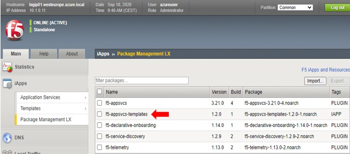
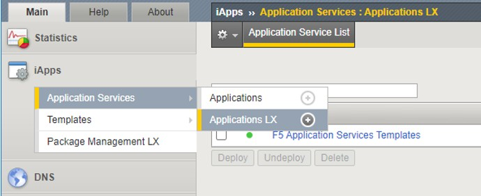
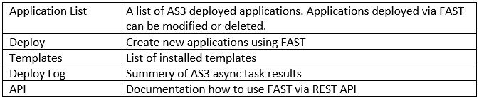
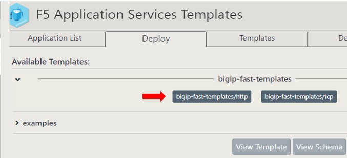
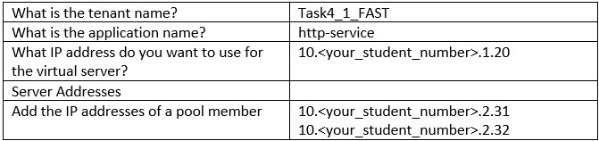

# Task 4.1 – Explore FAST via the GUI

Step 1: Login BIG-IP1 and go to iApps > Package Management LX and check if the FAST .rpm is installed.

 
FAST needs its own .rpm installed, but also the AS3 .rpm.

Next, go to **iApps > Application Services > Applications LX** and Select the **F5 Application Services Templates UI** extension.

 
Step 2: You must Sign in before getting access to the FAST extension (same as BIGIP username/password).

Step 3: The start window does not show much at this point but take your time to go through the tabs before continuing.

    :align: center

Step 4: Let’s deploy our first template using the FAST extension. Select tab ‘Deploy’ and in the “Available Templates” select ‘bigip-fast-templates’ and then click ‘bigip-fast-templates/http’.

    :align: center

Step 5: Fill in the template with the following values:

    :align: center

Leave everything else at the default values.

Click **‘Submit’**.

The Deploy log will show a successful creation of the template.

Step 6: Check if the virtual server is deployed and be sure to change to the right partition.

Step 7: Test the deployed config by using the public IP of the VIP (bigip_ext_pub_vippip1).

Step 8: Let’s go to the ‘Application List’ and watch our first template being in the list.
Scroll down to the bottom of the page and use the different buttons to view the Template, Schema, Inputs and Rendered.
Output is shown below the buttons.

