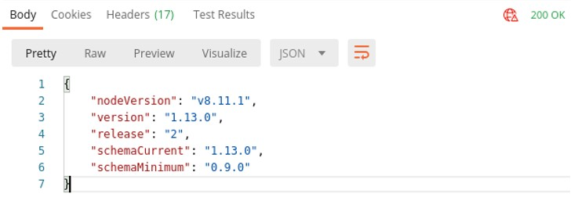
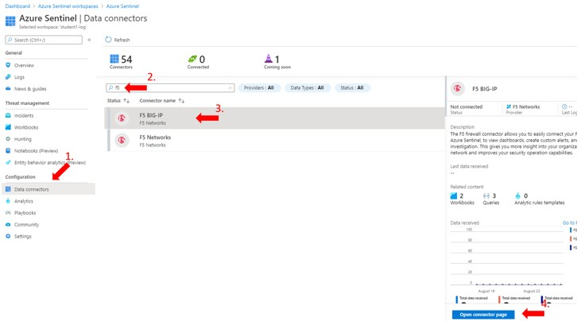
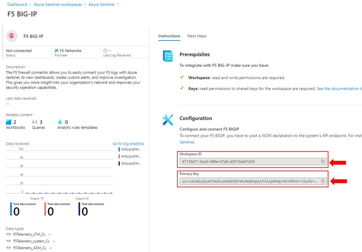

# Task 5.1 - Azure Sentinel and TS

This task will setup:
 - Azure Sentinel
 - Grab the Azure Sentinel Workspace ID and Primary Key
 - Deploy Telemetry Streaming Declaration

**Step 1:** As we done before with DO and AS3, first check if TS installed. Select **“Step 4.0: GET Telemetry Streaming info”** and click **‘Send’**.
 


**Step 2:** Login to the Azure portal and go to Resource groups and select **your created resource group recognized** by your student number.

**Step 3:** In the selected resource group find the Log Analytics Workspace called **‘student#-log’**.

A Log Analytics workspace is a unique environment for Azure Monitor log data. Each workspace has its own data repository and configuration, and data sources and solutions are configured to store their data in a particular workspace.

This object has been created with the deployment of the Azure infrastructure using Terraform. To verify go to Visual Studio Code and checkout main.tf. 
Otherwise you need to create it first to be able to get the next step.

**Step 4:** In Azure portal, use the search field at the top of the page to type sentinel and select **‘Azure Sentinel’**.


**Step 5:** In Azure Sentinel workspaces click **'+ Add'**  and select your Log Analytics workspace and press **‘Add Azure Sentinel’**.


**Step 6:** Once Azure Sentinel is created select **‘Data connectors’** and type **‘f5’** in the search field and hit enter.



Select the top F5 BIG-IP and click **‘Open connector page’**

**Step 7:** Here we are going to copy the Workspace ID and Primary Key and paste it into our TS declaration




**Step 8:** Open in Postman **“Step 5.1.1: Deploy Telemetry Streaming with Azure Sentinel”** and copy and paste the Workspace ID and Primary Key into the body of the Telemetry Streaming declaration.

```json

{
    "class": "Telemetry",
    "controls": {
        "class": "Controls",
        "logLevel": "debug",
        "debug": true
    },
    "My_System": {
        "class": "Telemetry_System",
        "systemPoller": {
            "interval": 60
        }
    },
    "My_Listener": {
        "class": "Telemetry_Listener",
        "port": 6514
    },
    "My_Consumer": {
        "class": "Telemetry_Consumer",
        "type": "Azure_Log_Analytics",
        "workspaceId": "<Workspace_ID>",
        "passphrase": {
            "cipherText": "<Primary_Key>"
        },
        "useManagedIdentity": false,
        "region": "westeurope"
    }
}
```
**Step 9:** Press **‘Send’** and check if the response returns a 200 OK.
At this point we have defined that a TS declaration should deliver its logs to Azure Sentinel, but we did not define an event listener and also didn’t define a log profile. Let’s use AS3 to complete the task.

**Step 10:** In Postman select **“Step 4.1.2: Configure Event listener”** and scroll through its Body and notice the following:

 - Virtual address used is 255.255.255.254
 - Port 6514 was already used in the TS declaration as the telemetry listener.
 - The Telemetry local rule is defined and only used when TS is a local listener.
 - The definition of a telemetry traffic log profile which includes a request template and makes use of HSL to get the logging delivered to Sentinel data connectors.
 - Includes a security log profile which uses Splunk

**Step 11:** Hit **‘Send’** and watch the response returning a 200 OK.

**Step 12:** Check the BIG-IP to understand what has been deployed.
This time we need to check partition Common to find VS ‘telemetry_local’


**Step 13:** Go to **Local Traffic > Profiles > Other > Request Logging** and select **“telemetry_traffic_log_profile”**. Check the configured profile and recognize the declared template.

**Step 14:** Go to **Security > Event Logs > Logging Profiles** and select **telemetry_security_log_profile**. Check to log profile and recognize the logging format definition and used server address.

**(Optional)**

Go to **System > Logs > Configuration > Log Destinations** and checkout **‘telemetry_formatted’** and **‘telemetry_hsl’**.

Finally go to **System > Logs > Configuration > telemetry_publisher** and checkout **telemetry_publisher**.

[PREVIOUS](module5.md)      [NEXT](task5_2.md)