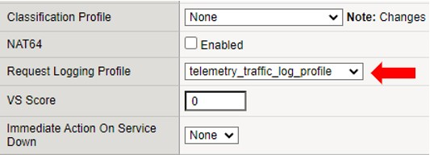
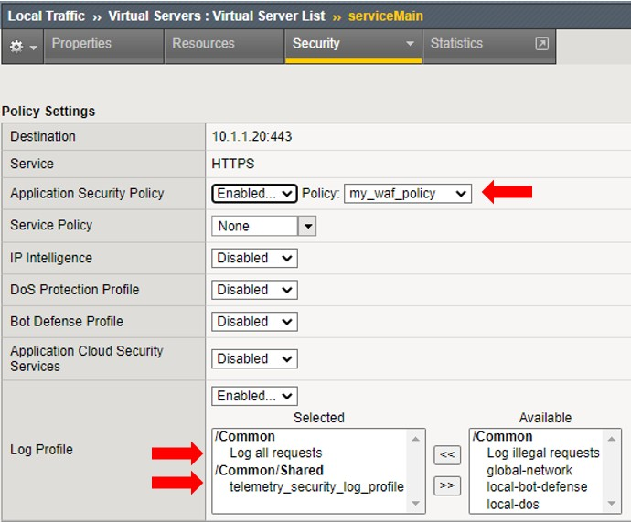
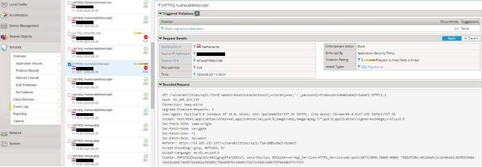

# Task 5.2 - Include WAF via an AS3 declaration

Step 1: Log into the BIG-IP and check:
 - The partitions section if besides partition Common, no other partition exists.
 - The Local Traffic section that no VS, pool or poolmember exists.
 - The Security section that no WAF policy exists.

Step 2: Go through below JSON schema and change the B-octet of each IP address to align with your student number.

```json
{
    "class": "AS3",
    "action": "deploy",
    "declaration": {
        "class": "ADC",
        "schemaVersion": "3.7.0",
        "id": "Deploy_WAF_Service_HTTPS",
        "label": "Deploy_WAF_Service_HTTPS",
        "remark": "Deploy_WAF_Service_HTTPS",
        "App_Services": {
            "class": "Tenant",
            "HTTPS_Service": {
                "class": "Application",
                "template": "https",
                "serviceMain": {
                    "class": "Service_HTTPS",
                    "virtualAddresses": [
                        "{{bigip_ext_priv_vippip1}}"
                    ],
                    "securityLogProfiles": [{
                            "bigip": "/Common/Log all requests"
                        },
                        {
                            "bigip": "/Common/Shared/telemetry_security_log_profile"
                        }
                    ],
                    "snat": "auto",
                    "pool": "web-pool",
                    "profileHTTP": "basic",
                    "serverTLS": "webtls",
                    "policyWAF": {
                        "use": "my_waf_policy"
                    },
                    "profileTrafficLog": {
                        "bigip": "/Common/Shared/telemetry_traffic_log_profile"
                    }
                },
                "web-pool": {
                    "class": "Pool",
                    "monitors": [
                        "icmp"
                    ],
                    "members": [{
                        "servicePort": 80,
                        "serverAddresses": [
                            "{{dvwa_server}}"
                        ]
                    }]
                },
                "webtls": {
                    "class": "TLS_Server",
                    "certificates": [{
                        "certificate": "webcert"
                    }]
                },
                "webcert": {
                    "class": "Certificate",
                    "certificate": {
                        "bigip": "/Common/default.crt"
                    },
                    "privateKey": {
                        "bigip": "/Common/default.key"
                    }
                },
                "my_waf_policy": {
                    "class": "WAF_Policy",
                    "url": "https://raw.githubusercontent.com/f5devcentral/f5-asm-policy-templates/master/owasp_ready_template/owasp-no-auto-tune-v1.1.xml",
                    "ignoreChanges": true
                }
            }
        }
    }
}
```

Notice the following:
 - The AS3 declaration makes use of Service_HTTPS.
 - Check the WAF policy and understand that it gets pulled from an external source.

Step 3: In Postman, select **“Step 5.2: Deploy HTTP_Service with WAF”** press **‘Send’**.

Step 4: Wait for the 200 OK and go into the BIG-IP to check the config.
Be sure to select the right tenant or you won’t see any configuration.
Go to **Local Traffic > serviceMain **and check the used **Request Logging Profile**.




Step 5: Next, in the virtual server section, select the tab **‘Security’** and click **‘Policies’**.



Be sure you see the WAF policy enabled and the log profile ‘Log all requests’ and ‘telemetry_security_log_profile’ has been Selected. Optional, you can check the WAF policy in the security section.

Step 6: Test the website by using the following URL: http://<BIG-IP_external_public_vip_address>. You will get redirected to HTTPS and ignore the warning.

Step 7: Login to the DVWA server with the credentials admin/password and do the following actions:

 - Click **‘Create / Reset Database’**.
 - Login again.
 - From the left menu, select **‘Instructions’**.
 - From the left menu, select *‘SQL Injection’** and 
 - fill in User ID ‘10’ press **‘Submit’**,
 - fill in User ID ‘20’ press **‘Submit’**,
 - fill in User ID ‘10 OR 1=1’ and press **‘Submit’**. This action was rejected, click **‘Go Back’**
 - From the left menu select **‘PHP Info’**, click **‘Go Back’**.
 - Finally, click **‘About’**.

All we just did was generating some traffic to get or logs filled.

Step 8: Go back to the BIG-IP and check **Security > Event Logs** and you should see something similar as below.



At this point it is proven that we have a working setup where a WAF policy is protecting a DVWA server from being compromised. 

[PREVIOUS](task5_1.md)      [NEXT](task5_3.md)