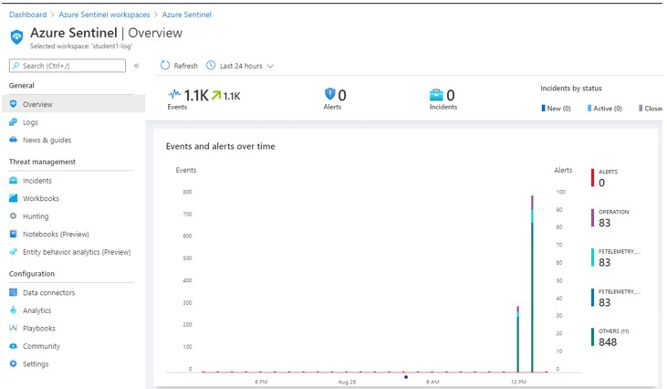
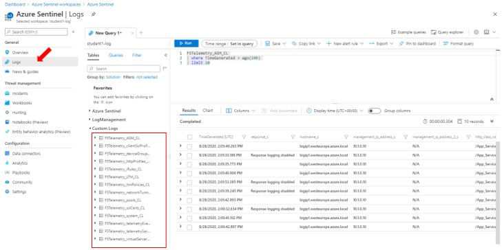
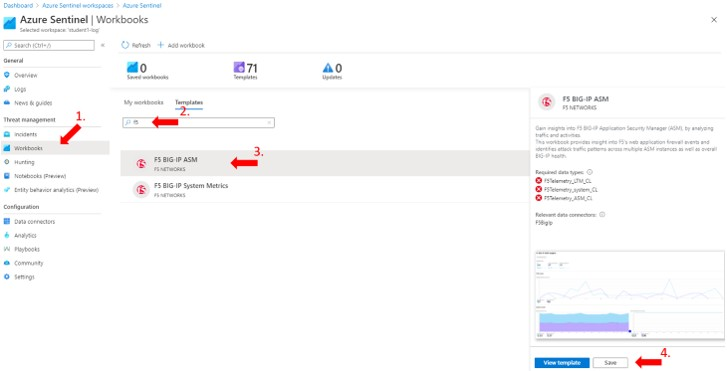
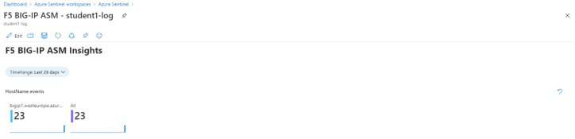

# Task 5.3 - Azure Sentinel

Step 1: Go to back to the Azure Portal and search Azure Sentinel in the upper search field.

Step 2: Select your **Log Analytics workspace** and you will be in the Sentinel Overview and you should already see some events and alerts.

    :align: center

Step 3: From the overview. Select **‘Logs’**, close the opened window **‘Example queries’** and select **‘Custom Logs’**.

    :align: center

This is the point where you can check if all required logs are actually being received.

Step 4: Select **‘Workbooks’** and in the search field type **‘f5’** and select **‘F5 BIG-IP ASM’** and click ‘Save’ and when asked for the location leave it at its default of ‘West Europe’ and hit **OK**.

    :align: center

Step 5: View the saved workbook and when prompted for missing required data types, hit **OK**.

Step 6: Your F5 BIG-IP ASM Insights should look like this.  
The number of shown events might be different.

Step 7: Scroll down though the dashboard to see more events. You should seem more events and even some violations. 

Voila, your F5 BIG-IP ASM integration in Azure Sentinel is finished.

Step 8: (Optional) repeat creating more logging by hitting the DVWA server with more traffic to see more dashboard movement.
